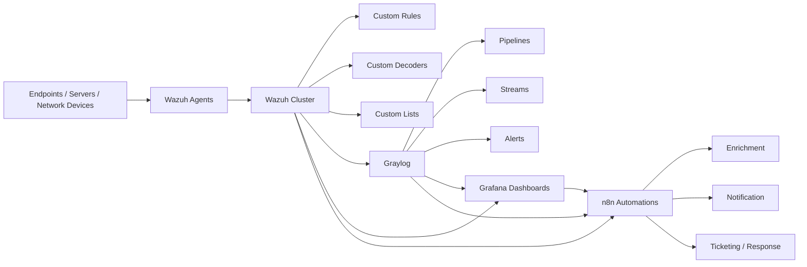

# Open Source SOC Production

<p align="center">
  
  
  
  
</p>

<p align="center">
  
  
  
  
</p>

This repository is the source of truth for a custom open-source SOC stack built on a **Wazuh cluster**, **Graylog**, **Grafana**, and **n8n** running on **server nodes**, not Kubernetes.

The goal is to version the parts that actually matter for SOC engineering:

- Custom Wazuh rules, decoders, and lists
- Custom Graylog pipelines, streams, and alerts
- Custom Grafana dashboards and alert logic
- Custom n8n workflows and response automations
- Shared schemas, mappings, and validation assets

It does **not** try to duplicate vendor documentation or basic setup steps already covered on official product websites.

## Block Diagram



## What This Repo Stores

### Included

- Detection engineering content
- Parsing and enrichment logic
- SOC dashboards and analyst views
- Automation workflows and integration glue
- Shared testing and normalization assets

### Not Included

- Default vendor configuration copied as-is
- Basic installation instructions from official docs
- Real credentials, keys, or secrets
- Uncurated exports with no operational value

## Repository Layout

```text
docs/        Architecture, node layout, data flow, and integration design
wazuh/       Custom detections, decoders, lists, integrations, and scripts
graylog/     Custom pipelines, streams, alerts, dashboards, and scripts
grafana/     Custom dashboards, panels, alert rules, and query patterns
n8n/         Custom workflows, subworkflows, payload examples, and scripts
shared/      Shared schemas, mappings, normalization patterns, and helpers
use-cases/   Detection and response scenarios mapped across multiple tools
tests/       Validation strategy, sample events, and verification notes
```

## Engineering Principles

- Organize content by tool first.
- Keep only custom and reusable SOC engineering artifacts.
- Make each detection and automation path reviewable in Git.
- Connect use cases across detection, visibility, and response.
- Prefer clear structure over dumping raw exports into the repo.

## Tool Focus

### Wazuh

- Custom rule categories
- Custom decoders
- Threat intel and enrichment integrations
- Cluster sync and health scripts

### Graylog

- Parsing pipelines
- Stream routing
- Enrichment logic
- Analyst alerting content

### Grafana

- SOC overview dashboards
- Detection telemetry
- Analyst reporting views
- Executive summary panels

### n8n

- Alert triage workflows
- Enrichment workflows
- Reporting automations
- Response orchestration playbooks

## Suggested Node Model

```text
Node 1  -> Wazuh master
Node 2  -> Wazuh worker 1
Node 3  -> Wazuh worker 2
Node 4  -> Wazuh indexer or search support
Node 5  -> Graylog
Node 6  -> Grafana
Node 7  -> n8n
```

## Documentation Map

- [Architecture](docs/architecture.md)
- [Data Flow](docs/data-flow.md)
- [Node Layout](docs/node-layout.md)
- [Integration Map](docs/integration-map.md)

## Next Build Steps

1. Finalize node placement and data paths.
2. Define the first real detection use cases.
3. Add custom rules, pipelines, dashboards, and workflows.
4. Add sanitized sample logs and validation assets.
5. Build deployment and health-check scripts around the custom content.

## House of SOC

If you want help setting this up, building new detections, or creating custom automation workflows, contact **House of SOC** at [hi@haxsecurity.com](mailto:hi@haxsecurity.com).
